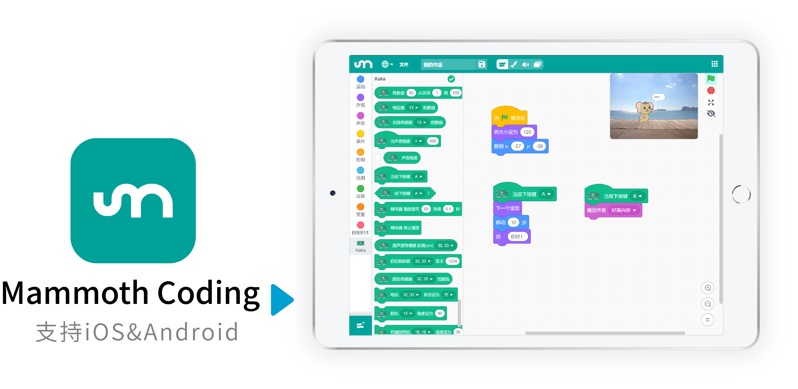

欢迎来到 Mammmoth Coding 文档主页！
=================================================

| **Mammoth Coding** 是一款专为kaka百变积木控制板设计的图形化编程软件。能够通过蓝牙连接基于ESP32的硬件，让孩子们在手机或平板上轻松学习编程，激发创造力。使用Mammoth Coding，用户可以轻松地学习硬件编程，制作属于自己的项目。

.. toctree::
   :maxdepth: 2

   install
   quickstart
   page
   block