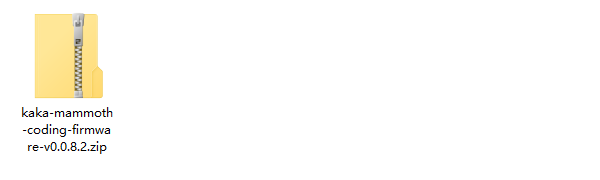
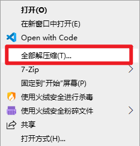
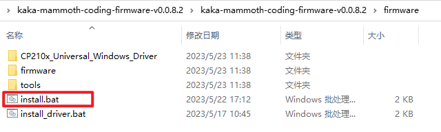
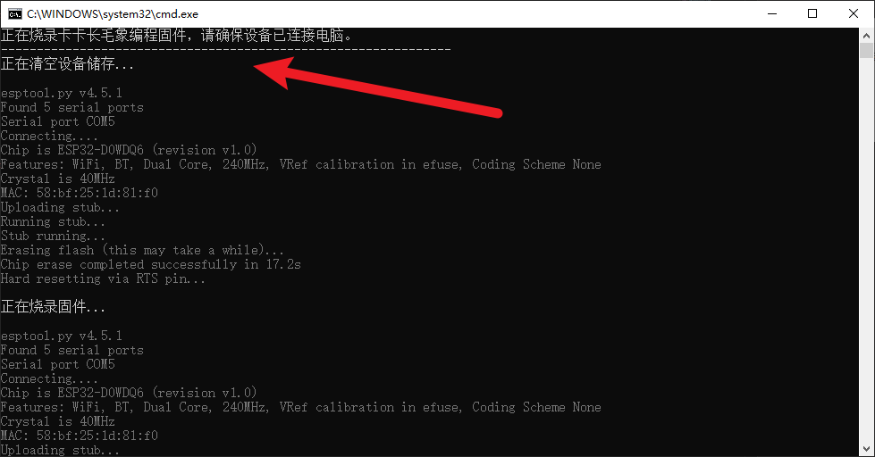
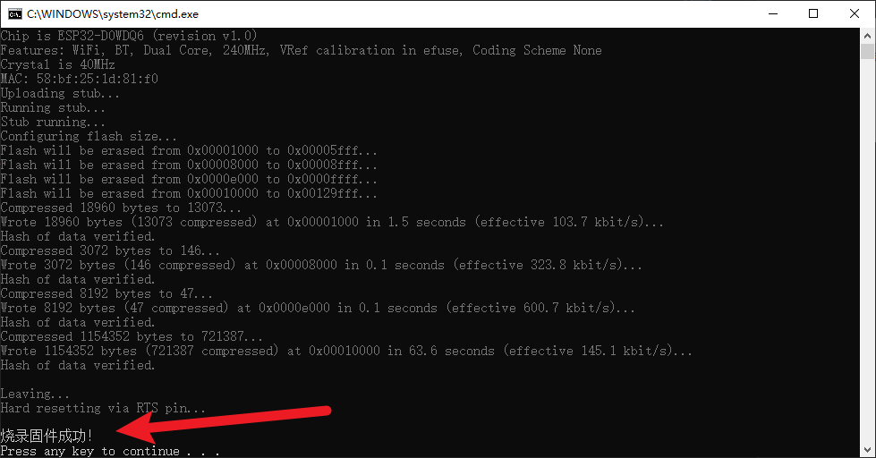
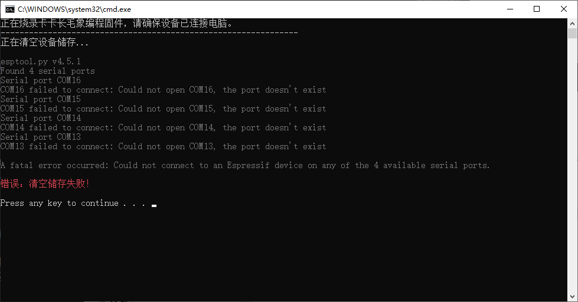
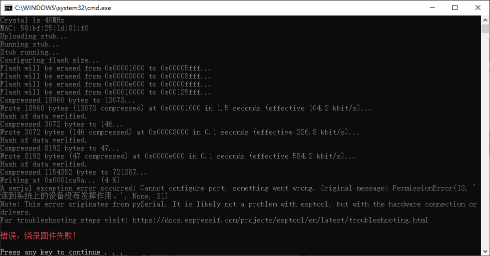

连接指南
===============
本篇教程以使用Mammthon Coding APP遥控百变积木控制板的板载蜂鸣器作为示例，帮助你快速熟悉连接流程。

需要准备：
 #. 百变积木控制板。
 #. 安装Mammthon Coding APP的设备，设备需要支持蓝牙。

连接百变积木控制板
---------------------------------------------

#. 打开百变积木控制板，当百变积木控制板上的LED一直闪烁，则说明百变积木控制板正在等待连接。

    .. image:: img/open_kakaboard.webp
        :width: 450

#. 打开Mammthon Coding APP，在 **左下角** 点击 **添加拓展**。

    .. image:: img/shadow_connect-1.png
        :width: 450

#. 选择 **卡卡** 拓展。

    .. image:: img/shadow_connect-2.png
        :width: 450

#. 选择你的设备，点击连接。连接成功后，连接窗口会显示已连接，且百变积木控制板上的LED会由一闪一闪变成一直亮。

    .. image:: img/shadow_connect-3.png
        :width: 450

    .. image:: img/shadow_connect-3b.png
        :width: 450    

编写代码测试连接
------------------------------

#. 在卡卡类别中，拖出 “蜂鸣器播放音符（60）持续（0.5）秒” 代码块。

    .. image:: img/shadow_test-1.png
        :width: 450

#. 在代码区点击这个代码块，如果能够听到百变积木控制发出“滴”的声音，则说明远程遥控成功。

    .. image:: img/shadow_test-2.png
        :width: 450 

疑难解答
---------------

#. 在连接界面搜索不到设备？

   请尝试以下步骤：

   a. 尝试点击刷新按钮，再耐心等待。    

    .. image:: img/connectQA-1.png
        :width: 250

   b. 检查百变积木控制板的开关是否打开,并且LED一闪一闪？如果没有打开，请打开。

    .. image:: img/open_kakaboard.webp
        :width: 300

   c. 检查LED闪烁情况。如果LED长亮的，则说明主板已被连接，请检查主板是否被其它设备连接。如果LED不闪，则需要重新升级固件，请查看 :ref:`升级固件 <update>` 的部分。

   d. 检查设备的 **蓝牙** 和 **位置信息** 是否打开。如果没有打开，请打开。

    .. image:: img/connectQA-2.png
        :width: 350   

#. 打开百变积木控制板后，百变积木控制板上的LED不亮，不会一闪一闪？

   需要升级固件，请查看 :ref:`升级固件 <update>` 的部分。

.. _update:

升级固件
---------------

.. note:: 
    升级固件需要使用到Windows电脑。

1.下载固件升级程序
~~~~~~~~~~~~~~~~~~~
   
点击 `下载链接 <https://ezblock.com.cn/app_v2/kaka-firmware-v1.0.0.2.zip>`_ 下载固件升级程序。

2.运行固件升级程序
~~~~~~~~~~~~~~~~~~~

下载完后，我们会得到一个名为 **kaka-mammoth-coding-firmware.zip** 的压缩包。
   

用鼠标右键点击这个压缩包，然后选择“全部解压缩”，解压这个压缩包。

双击 **install.bat** 运行固件升级程序。

   
当提示 **固件烧录成功!** 则说明固件升级已经完成。
   

3.固件升级过程中遇到问题
~~~~~~~~~~~~~~~~~~~~~~~~~~

.. warning:: 
    升级过程中可能会出现如下错误。需要按照下面的提示重新尝试。

如果固件升级过程出现红色的错误提示，你可以按顺序尝试以下几种操作：

#. 检查电脑与百变积木控制板之间的连接。重新连接电脑和百变积木控制板。

#. 右键点击 **install_driver.bat** ，点击 **以管理员身份运行** 运行安装驱动程序。安装驱动成功后，再次运行 **install.bat**。

   .. image:: img/fw_update_error-3.png  
   .. image:: img/fw_update_error-4.png 

#. 如果前面的步骤都无法解决问题。重新连接电脑和百变积木控制板。再次运行 **install.bat** ，在弹出的窗口每次出现 **Connecting ...** 时，长按 **百变积木控制板上的A按键**。

   .. image:: img/fw_update_error-5.png

